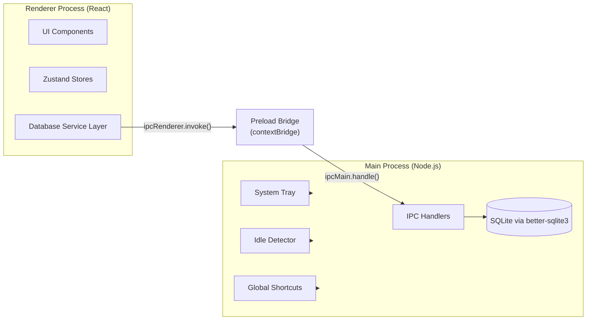
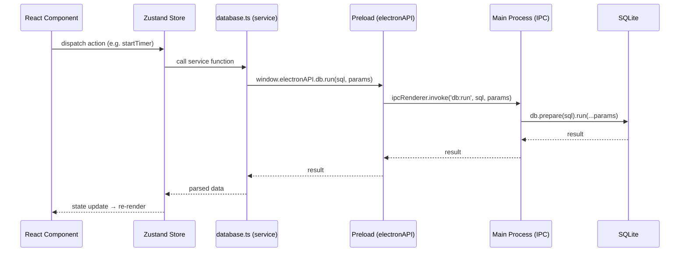
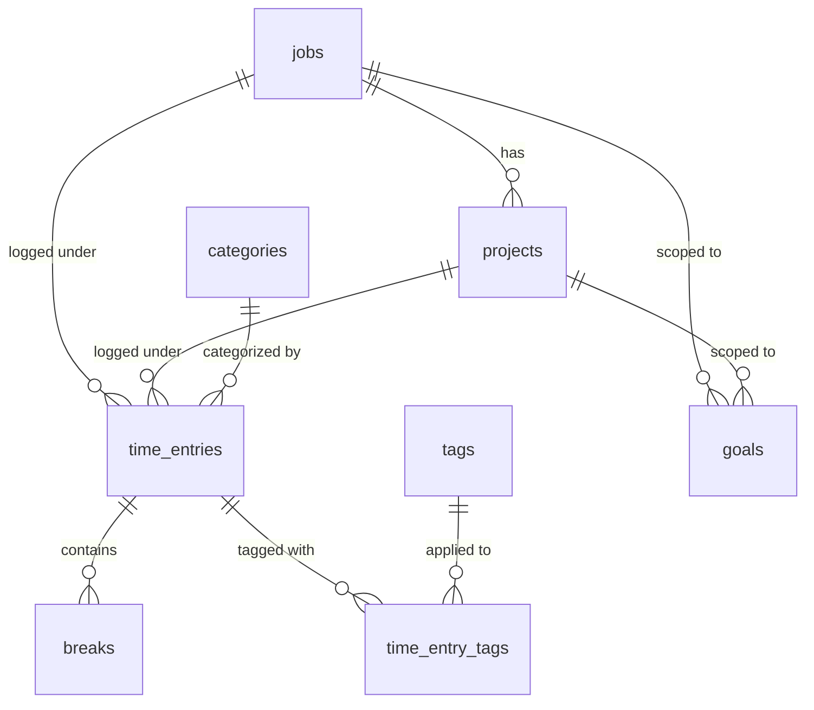

# Architecture

> **Last updated:** March 2026

**Purpose:** Describe the high-level architecture of ChronoLog — processes, data flow, database schema, state management, and key patterns.

---

## System Overview

ChronoLog follows the standard Electron two-process model:



| Process   | Responsibility                                                                 |
| --------- | ------------------------------------------------------------------------------ |
| Main      | Electron lifecycle, SQLite database, IPC handlers, tray, idle detection, shortcuts |
| Preload   | Secure bridge between renderer and main via `contextBridge.exposeInMainWorld`  |
| Renderer  | React UI, state management (Zustand), routing, i18n, theming                  |

---

## Directory Structure

```
chronolog/
├── electron/                  # Main process source
│   ├── main.ts                # App entry, window creation, IPC setup
│   ├── preload.ts             # Context bridge (electronAPI)
│   ├── tray.ts                # System tray setup
│   ├── idle-detector.ts       # Idle/lock detection
│   ├── data-transfer.ts       # Export/import logic
│   └── database/
│       ├── db.ts              # Database init, WAL mode, connection
│       └── migrations.ts      # Schema migrations (versioned)
├── src/                       # Renderer process source
│   ├── App.tsx                # Root component (FluentProvider, layout)
│   ├── main.tsx               # React entry point
│   ├── components/            # UI components by feature
│   │   ├── Analytics/         # Charts, heatmap
│   │   ├── CommandPalette/    # Ctrl+K command palette
│   │   ├── Dashboard/         # Daily/weekly overview
│   │   ├── Entries/           # Time entry list & management
│   │   ├── Goals/             # Goal tracking
│   │   ├── Layout/            # App shell, sidebar (incl. user profile), titlebar
│   │   ├── Manage/            # Jobs, projects, categories, tags CRUD
│   │   ├── Settings/          # App settings, profile management, password change
│   │   └── Timer/             # Timer widget, Pomodoro
│   ├── i18n/                  # Internationalization
│   │   ├── index.ts           # i18next config
│   │   ├── de.json            # German translations
│   │   └── en.json            # English translations
│   ├── services/
│   │   └── database.ts        # Renderer-side DB abstraction (calls preload bridge)
│   ├── stores/                # Zustand state stores
│   │   ├── appStore.ts        # Theme, language, settings, navigation
│   │   ├── dataStore.ts       # Jobs, projects, categories, tags
│   │   ├── timerStore.ts      # Timer status, current entry, breaks
│   │   └── userStore.ts       # User authentication and profile
│   ├── styles/
│   │   └── global.css         # Global stylesheet
│   ├── types/
│   │   └── index.ts           # Shared TypeScript interfaces
│   └── utils/
│       └── helpers.ts         # Formatting and utility functions
├── assets/                    # App icon, images
├── docs/                      # This documentation folder
├── package.json
├── vite.config.ts
├── tsconfig.json
└── electron-builder.yml       # Packaging config
```

---

## Data Flow



### IPC Channel Categories

| Channel Prefix | Purpose                                    |
| -------------- | ------------------------------------------ |
| `db:*`         | Database queries (`query`, `run`, `get`)   |
| `app:*`        | Window controls, version, paths            |
| `theme:*`      | Theme get/set, change notifications        |
| `idle:*`       | Idle time queries, state change events     |
| `tray:*`       | Tray tooltip updates                       |
| `data:*`       | Export/import (`.chronolog`, CSV)           |
| `notify`       | Desktop notifications                      |
| `shortcut:*`   | Global shortcut events (toggle timer)      |

---

## Database Schema

The database is a single SQLite file stored at `{userData}/chronolog.db` using WAL journal mode. Schema is managed through versioned migrations in `electron/database/migrations.ts`.

### Entity-Relationship Diagram



### Tables

| Table              | Purpose                                          | Key Columns                                             |
| ------------------ | ------------------------------------------------ | ------------------------------------------------------- |
| `jobs`             | Jobs or work contexts                       | id, name, color, hourly_rate, currency, is_archived     |
| `projects`         | Projects within a job                            | id, job_id (FK), name, color, is_favorite, is_archived  |
| `categories`       | Work type classification                         | id, name, icon, color, is_archived                      |
| `tags`             | Free-form labels                                 | id, name, color                                         |
| `time_entries`     | Core time records                                | id, job_id, project_id, category_id, start/end_time, is_running |
| `time_entry_tags`  | Many-to-many join (entries ↔ tags)               | time_entry_id, tag_id (composite PK)                    |
| `breaks`           | Coffee/lunch breaks within an entry              | id, time_entry_id, break_type, start/end_time           |
| `goals`            | Daily/weekly/monthly hour targets                | id, goal_type, target_hours, job_id, project_id         |
| `achievements`     | Unlockable badges                                | id, key, name, description, icon, unlocked_at           |
| `gamification`     | Singleton row: XP, level, streaks                | id=1, xp, level, current_streak, longest_streak         |
| `settings`         | Key-value app settings                           | key (PK), value                                         |
| `audit_log`        | Change history for entities                      | entity_type, entity_id, action, old/new_values          |
| `migrations`       | Schema migration tracking                        | version, description, applied_at                        |

### Default Settings

| Key                       | Default   |
| ------------------------- | --------- |
| `language`                | `de`      |
| `theme`                   | `system`  |
| `coffee_break_max_minutes`| `15`      |
| `idle_threshold_minutes`  | `5`       |
| `daily_target_hours`      | `8`       |
| `weekly_target_hours`     | `40`      |
| `gamification_enabled`    | `true`    |
| `notifications_enabled`   | `true`    |
| `pomodoro_work_minutes`   | `25`      |
| `pomodoro_break_minutes`  | `5`       |
| `compact_mode`            | `false`   |

---

## State Management

Four Zustand stores manage all client-side state:

### `appStore`

Global application state — navigation, theme, language, settings, sidebar, command palette.

| State               | Type                | Description                          |
| ------------------- | ------------------- | ------------------------------------ |
| `currentPage`       | `NavPage`           | Active page in the sidebar           |
| `theme`             | `ThemeMode`         | `'light' \| 'dark' \| 'system'`     |
| `resolvedTheme`     | `'light' \| 'dark'` | Actual applied theme                 |
| `language`          | `string`            | Current locale (`'de'` or `'en'`)    |
| `settings`          | `Record<string, string>` | All settings from DB            |
| `isSidebarCollapsed`| `boolean`           | Sidebar collapsed state              |
| `isCommandPaletteOpen` | `boolean`        | Command palette visibility           |

### `dataStore`

Master data — jobs, projects, categories, tags. Provides CRUD actions that persist to SQLite and update the store.

### `userStore`

User account state — current user, authentication, profile management. Provides login, logout, password change, and profile update actions.

### `timerStore`

Timer lifecycle — status (`idle` / `running` / `paused`), current time entry, active break, elapsed seconds, selected job/project/category. Reads `currentUser` from `userStore` and passes `user_id` to `createTimeEntry` for multi-user attribution.

---

## Internationalization

- Powered by **i18next** with the **react-i18next** plugin.
- Two locale files: `src/i18n/de.json` (German, default) and `src/i18n/en.json` (English).
- Default and fallback language: German (`de`).
- Language preference is persisted in the `settings` table and loaded on startup.
- Adding a new language requires creating a new JSON file and registering it in `src/i18n/index.ts`.

---

## Key Patterns

| Pattern                    | Where Used                            | Why                                                     |
| -------------------------- | ------------------------------------- | ------------------------------------------------------- |
| Context isolation          | `preload.ts`                          | Security: renderer cannot access Node.js APIs directly  |
| Service abstraction        | `src/services/database.ts`            | Decouples UI from IPC details                           |
| Versioned migrations       | `electron/database/migrations.ts`     | Safe, incremental schema evolution                      |
| Singleton instance lock    | `main.ts` (`requestSingleInstanceLock`) | Prevents multiple app instances                        |
| Frameless window + overlay | `main.ts` (`frame: false`)            | Custom titlebar with native window controls             |
| Splash screen              | `main.ts` + `splash.html`            | Smooth startup UX while DB initializes                  |
| WAL journal mode           | `db.ts` (`pragma journal_mode = WAL`) | Better concurrent read performance                      |
| Global shortcuts           | `main.ts` (`globalShortcut`)          | Toggle timer / show window from anywhere                |
| Store-driven rendering     | Zustand stores                        | Minimal re-renders, simple API, no boilerplate          |
